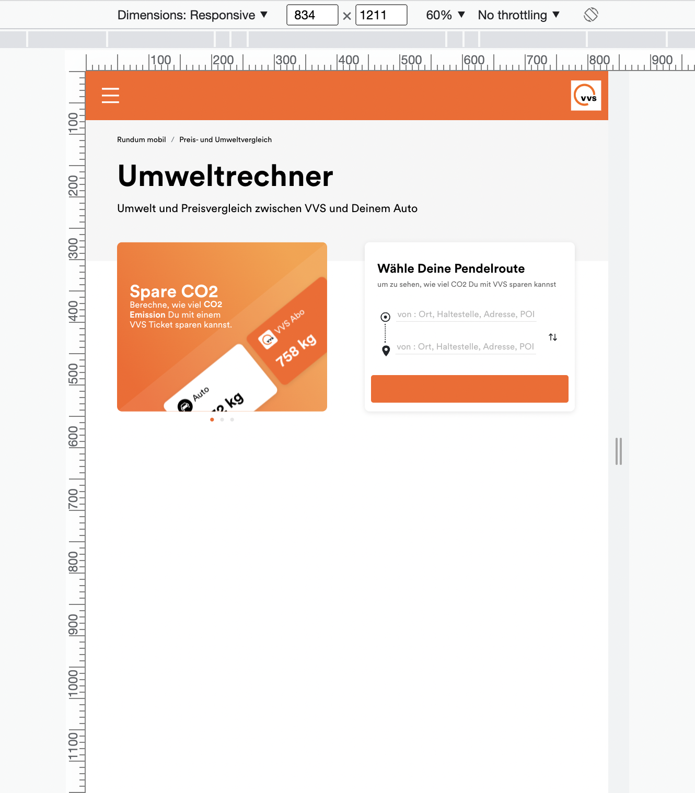
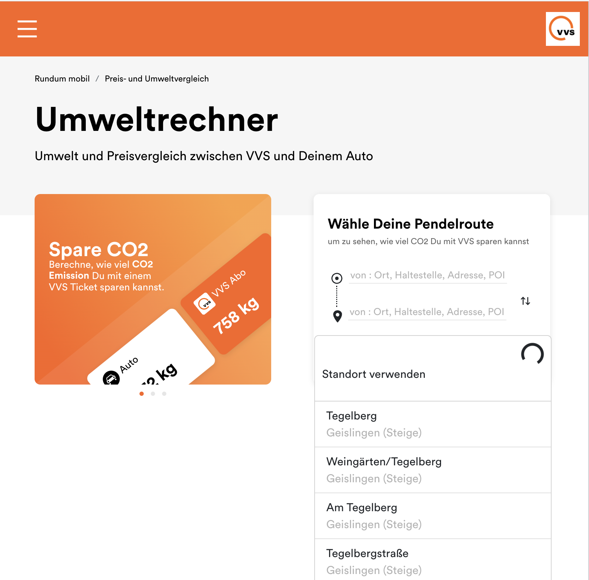
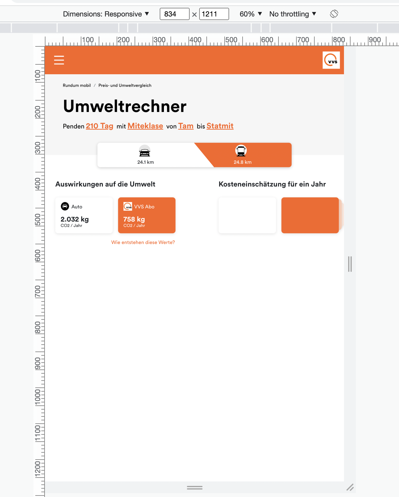
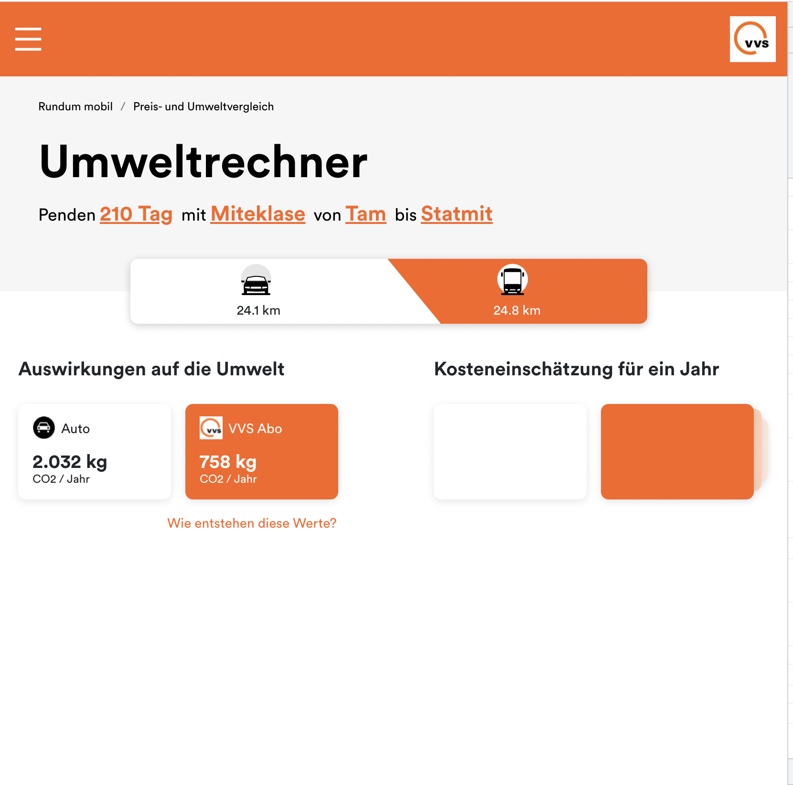

First  enter the root director of the project then install the `node modules` by run:

### `npm install`

Then run the project by

### `npm start`

Runs the app in the development mode.\
Open [http://localhost:3000](http://localhost:3000) to view it in your browser.

`Also the screen resoultions are not same home screen 834px and details screen 768px. so design is not consistance`

`when you type origin and destination location please select the name from the suggession. (wait after typing until its show the suggestion)it is required.`

 Run the test by 
### `npm test`

The second api for trip searech does not work as expected, i have fetched the data sucessfully but i did not find there  those mentioned params in the pdf. So in the details page i did not use api data. 

### Here are some screenshot

1. 
2.  
3. 
4. 

